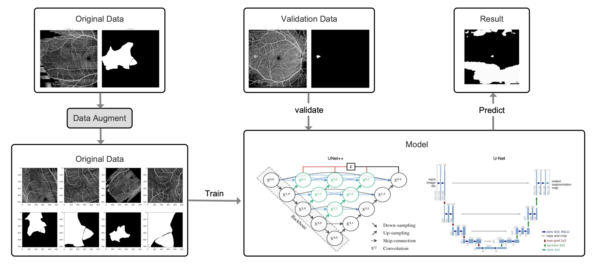

# DRAC2022
Team Project of CS3511 in spring, 2024

---

This repository contains the implementation of a deep learning model for the segmentation of diabetic retinopathy lesions, based on the DRAC2022 dataset. The model utilizes the Unet++ architecture with attention mechanisms to accurately segment microaneurysms, non-perfusion areas, and neovascularization in retinal images.

For more detailed information, please refer to the [report](./report.pdf).

